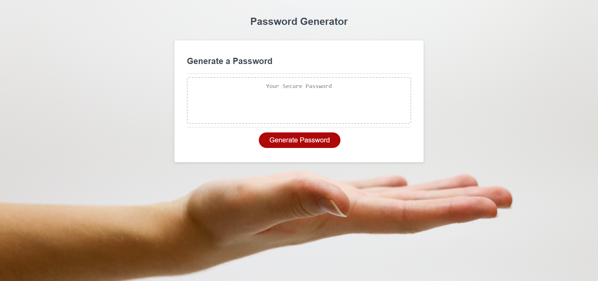

# Password Generator

## Description

In this challenge, I was asked to create an application that an employee can use to generate a random password based on criteria they've selected. Starter code was given for the assignment.

## Table of Contents 

Please refer to Table Of Contents.

- [Requirements](#requirements)
- [Screenshot](#screenshot)
- [Link To Deployed Application](#link-to-deployed-application)

## Requirements

- An employee wants to generate a random and secure password
- When the button is clicked a series of prompts are presented for password criteria
- Prompts include length of password, upper cased characters, lower cased characters, numeric characters and special characters
- The input is validated and at least one character choice has to be selected
- When all prompts are selcted, a password is created based on the choices made
- The password is displayed in the generator 

CREDIT NOTES: I worked with a Tutor on putting statements into function, and with classmates in a group to finish the assignment.

## Screenshot 

Please reference this photo for the password generator project.

## Link To Deployed Application

Please refer to deployed application directly:

[Password Generator](https://susorocode.github.io/password-generator/)

